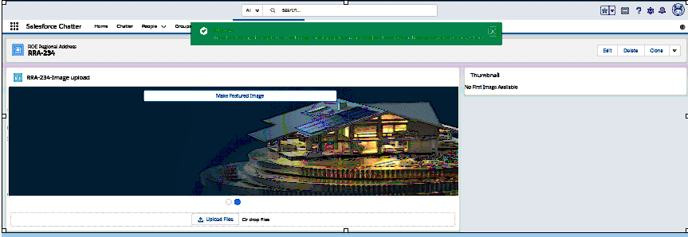
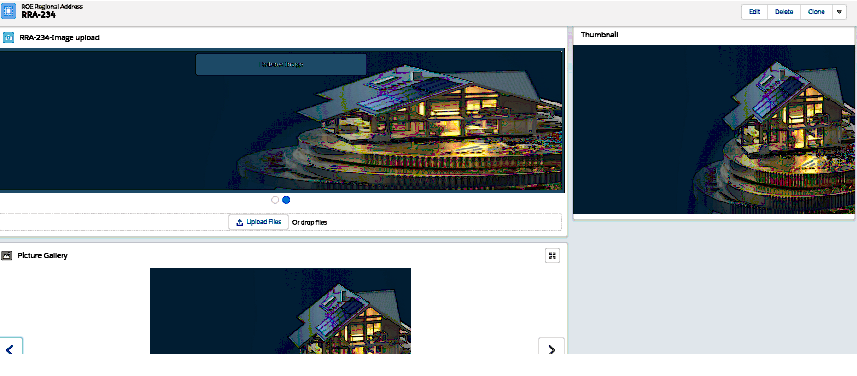
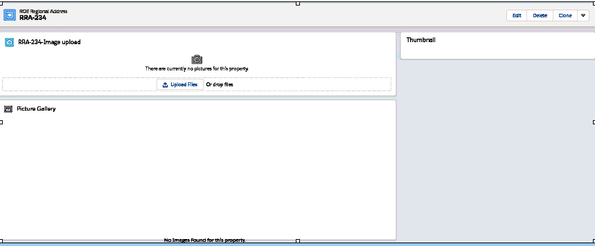
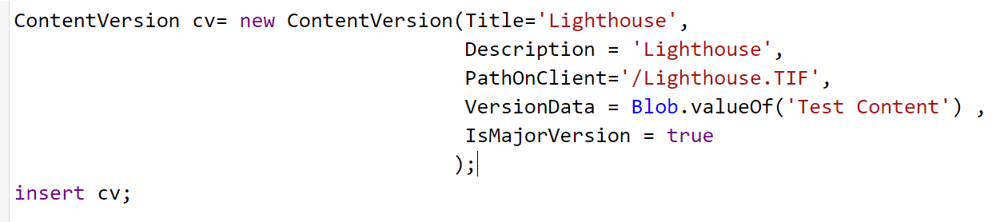

# Standalone component of Rediforce Picture Functionality

User can select a specific image as the primary image and user will have ability to select an image which should be the first image displayed in an image carousel and as the thumbnail . 

# Installation Instructions
1. Deploy package via ANT, `ant deployCode`

# Usage Instructions

- Now upload images and click on featured Image button and refresh the page.

- Once refreshed, user can see the featured image on Gallery card as first image  and first image will be displayed as Thumnail.

## Configure Component
- Open Lightning Record Page editor for the desired object.
- Place component anywhere on the page.
- Save and/or activate

# Pre-Deployment Step

- Insert Conversion Version in Anonymous window

