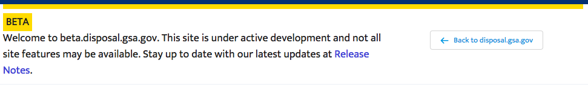
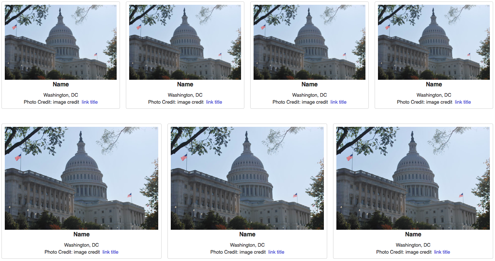
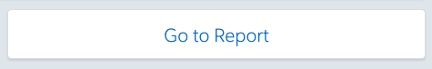

# Salesforce Lightning Components
A collection of reusable Salesforce Lightning Components. Each directory contains a README describing the component, an independent package.xml, and relevant code and resources.

Check out the [CONTRIBUTING](CONTRIBUTING.md) doc for details on how to add to this collection.

# Included Components
Below are some quick examples of the components included in this repository.

## [Community Beta Banner](https://github.com/GSA/sf-lightning-components/tree/master/communityBetaBanner)

## [Image Thumbnail Gallery](https://github.com/GSA/sf-lightning-components/tree/master/ImageThumbnailGallery)

## [Link to Report](https://github.com/GSA/sf-lightning-components/tree/master/linkToReport)

## [USWDS USA Banner](https://github.com/GSA/sf-lightning-components/tree/master/uswdsUSABanner)

