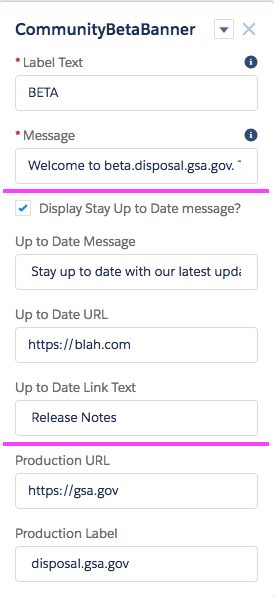

# Community Beta Banner
This component creates a simple site banner which can indicate to users that a given site is in Alpha or Beta status.

## Installation Instructions
Most apps require a simple deployment via package.xml. Spell out all of the steps here.

1. Deploy package via ANT, `ant deployCode`

# Usage Instructions
Banner is comprised of three primary sections as well as the ability to change the banner color.

### Border Color
Defaults to gold (#ffd700). Input accepts recognized color names or hex values, # must be included, as described at [https://www.w3.org/wiki/CSS/Properties/color/keywords](https://www.w3.org/wiki/CSS/Properties/color/keywords).

### Label & Message
The label is the text that lives within the gold block. It is suggested to use ALPHA or BETA. The message is the note to users about the site.

### Up to Date Message
This is a toggle-able feature which allows for the display of a further message including a link. Here, a site admin can direct users to release notes or another link with information about the new site.

### Production Link
This button provides users a link to go back to the main production site.

## Release Notes
April 28, 2020  - Added new Banner Color component and adjusted character spacing within messages.