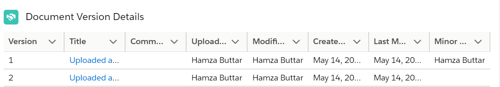
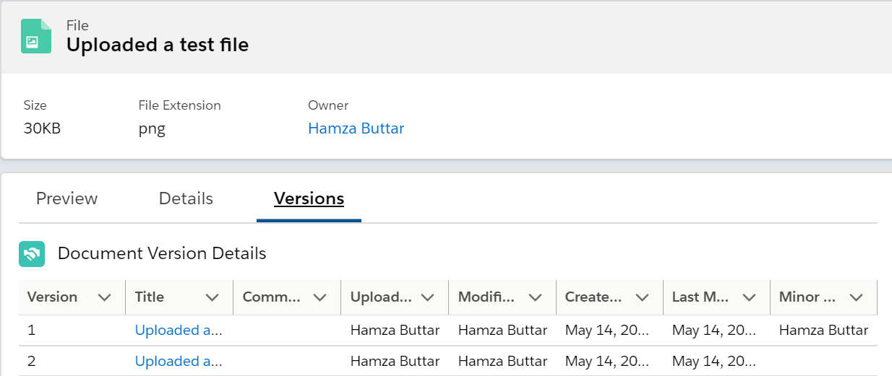

# Lightning Web Component for Content Version List

This component was built to show the list of content versions for the content document object.
 

## Installation Instructions

1. Deploy the package in the respective org.
2. Open the record page of the object , then go to related list.
3. Click View all link in the Files related list. 
4. Click the drop down button on the F	iles record and choose View File Details.
5. Click on the gear icon(Setup) -> Choose Edit Page
6. Create a new tab and name it Versions
7. Drag this LWC component in the newly created tab of the page.
8. Save the page and click on Activate.

## Usage Instructions 
All the versions of the content document will be listed in this component as shown in the picture below.

