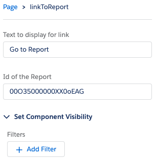

# Link to Report
Provides a 100% width clickable link that takes user to a report filtered for that record.

# Installation Instructions
1. Deploy package via ANT, `ant deployCode`

# Usage Instructions
## Create Report
Hat tip to [www.salesforceben.com](www.salesforceben.com) for the report URL hack which he describes at [http://www.salesforceben.com/salesforce-reports-url-hack/](http://www.salesforceben.com/salesforce-reports-url-hack/). Follow his steps to establish the report. Copy the Report Id.

## Configure Component
- Open Lightning Record Page editor for the desired object.
- Place component anywhere on the page.
- Paste Report Id into config menu.
- Save and/or activate

