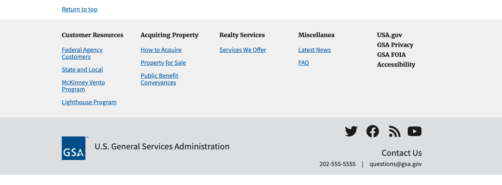
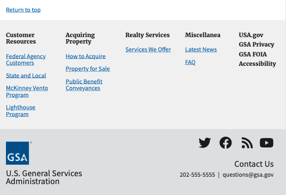
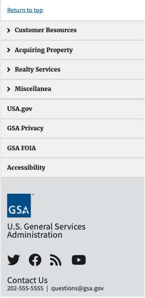
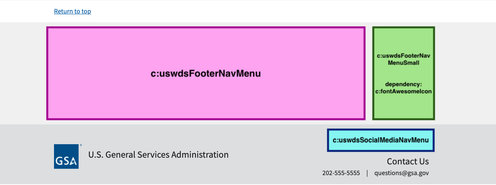

# US Web Design System Footer Big

Component is used to display a US Web Design System Big Footer as described at [https://designsystem.digital.gov/components/footer/](https://designsystem.digital.gov/components/footer/). The footer is comprised of multiple sub-components which must also be installed, see [Dependencies](#dependencies).

## Examples

### Desktop



### Tablet



### Phone



## Dependencies

### US Web Design System

* Whereever footer is used, page should load US Web Design System JS and CSS v2.5 or greater
* Use of Social Media Nav Menu relies on Font Awesome. See [https://github.com/gsa/sf-lightning-components/tree/master/fontAwesomeIcon](https://github.com/gsa/sf-lightning-components/tree/master/fontAwesomeIcon)

### Lightning Components



* [fontAwesomeIcon](https://github.com/gsa/sf-lightning-components/tree/master/fontAwesomeIcon)
* [uswdsFooterNavMenu](https://github.com/gsa/sf-lightning-components/tree/master/uswdsFooterNavMenu)
* [uswdsFooterNavMenuSmall](https://github.com/gsa/sf-lightning-components/tree/master/uswdsFooterNavMenuSmall)
* [uswdsSocialMediaNavMenu](https://github.com/gsa/sf-lightning-components/tree/master/uswdsSocialMediaNavMenu)
* If not already created, create an empty Lightning Token Bundle.
  * Developer Console > File > New > Lightning Tokens
  * Name it `defaultTokens`

````apex
<aura:tokens extends="forceCommunity:base">
</aura:tokens>
````

  * Save

## Installation Instructions

1. Copy associated packages for dependent [Lightning Components](#lightning-components) into a single `src/` file
1. Deploy package via ANT, `ant deployCode`

## Component Reference

Additional component details can be found in the Aura Component reference after deployment. Access by going to `https://{SF Instance Name}/aura`.
