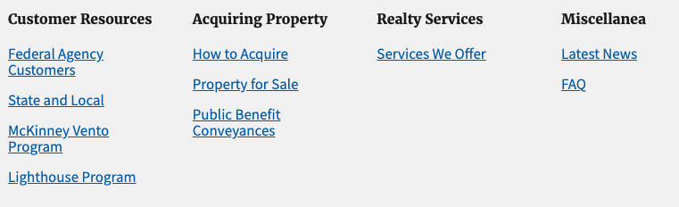

# US Web Design System Footer Navigation Menu

Displays a multi-tiered navigation menu (labels and sub-items). Component expects a navigation menu made up of solely labels and sub-items. First tier navigation links will not be displayed. For menus made up of only first tier links, use [uswdsFooterNavMenuSmall](https://github.com/gsa/sf-lightning-components/tree/master/uswdsFooterNavMenuSmall). To see how this fits together into a larger site footer, see [uswdsFooterBig](https://github.com/gsa/sf-lightning-components/tree/master/uswdsFooterBig). 

## Installation Instructions

1. Deploy package via ANT, `ant deployCode`

## Usage Instructions

Component resides as a sub-component of the [uswdsFooterBig](https://github.com/gsa/sf-lightning-components/tree/master/uswdsFooterBig).

* Navigate to Community Builder
* Click Settings (cog wheel icon) > Navigation
* Create navigation menus as needed. Copy developer name or record Id and place into configuration menu. 

## Component Reference

Additional component details can be found in the Aura Component reference after deployment. Access by going to `https://{SF Instance Name}/aura`.
