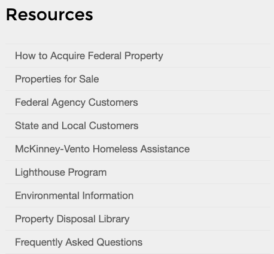
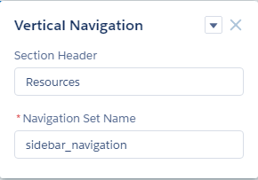

# US Web Design System Vertical Navigation

Component leverages the [US Web Design System](https://designsystem.digital.gov/components/sidenav/) Side Navigation component and consumes Salesforce Lightning Communities native Navigation Menu Builder data.

## Installation Instructions

1. Deploy package via ANT, `ant deployCode`

## Usage Instructions

* Navigate to Community Builder
* Click Settings (cog wheel icon) > Navigation
* Create navigation menus as needed
* Drag component onto page. Define a menu header (optional) as well as Navigation Set Name which can be either the developer name of a Navigation Menu. Developer name is a lowercase version of the label where underscores are substituted for spaces. For instance "My Navigation Menu" would have a developer name of "my_navigation_menu".

## Component Reference

Additional component details can be found in the Aura Component reference after deployment. Access by going to `https://{SF Instance Name}/aura`.
